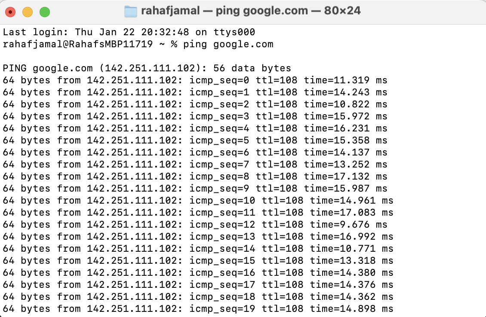

# Lab 01: Network Traffic Observation
**Date:** January 30, 2026  
**Status:** Completed  

## 🎯 Objective
To observe and analyze basic network traffic to understand how devices communicate over a network.

## 🛠️ Tools Used
- Wireshark  
- Linux Terminal  
- Classroom lab environment  

## 🔍 Key Findings
1. Observed TCP and DNS traffic between devices.
2. Identified how packets show source and destination addresses.
3. Learned how normal network traffic appears.

## 💡 Lessons Learned
This lab helped build foundational understanding of network communication. Recognizing normal traffic is important before identifying suspicious behavior.

## 📸 Proof of Work

